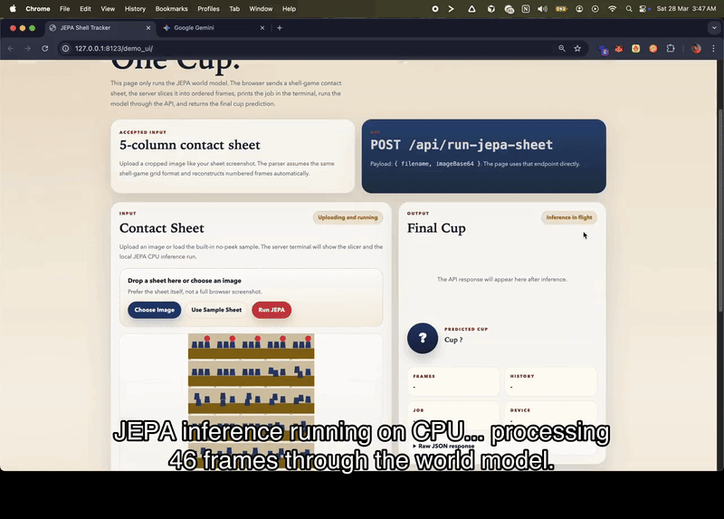
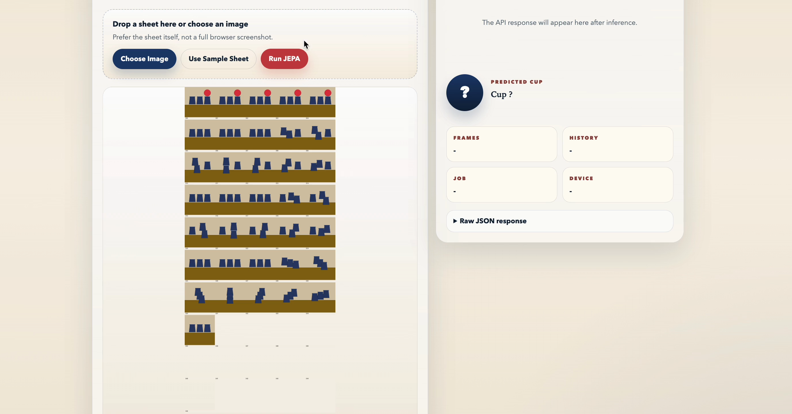
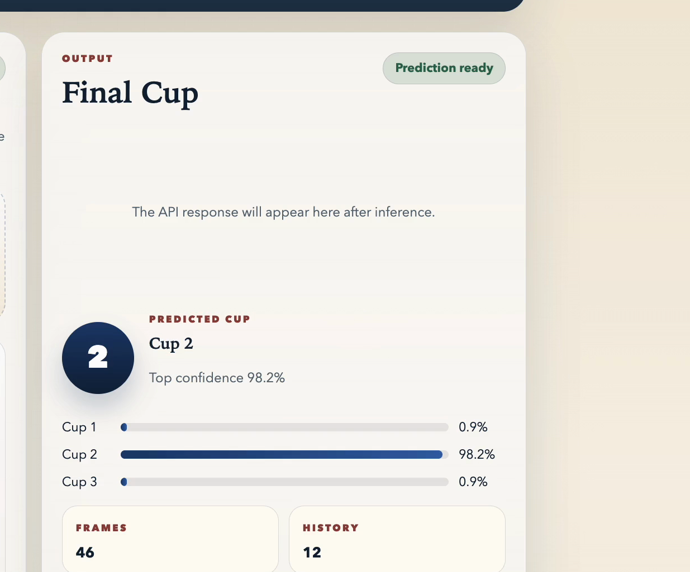

<div align="center">

# Shell Game World Model

**A JEPA-style world model that learns to track a hidden ball through shell game manipulations**

[](https://huggingface.co/illegalcall/jepa-track-hidden-ball)
[](./LICENSE)
[](https://huggingface.co/illegalcall/jepa-track-hidden-ball)
[](https://huggingface.co/illegalcall/jepa-track-hidden-ball)

<br>

Upload a contact sheet &rarr; slice into frames &rarr; predict the hidden ball's final position

<br>



</div>

---

## Key Finding

| Swaps | Accuracy | |
|:---:|:---:|:---|
| **1** | **100.0%** &pm; 0.0% | Perfect tracking |
| **3** | **74.3%** &pm; 2.9% | Well above chance |
| **1-4** | **75.8%** &pm; 2.7% | Curriculum-trained |
| **1-5** | **74.5%** &pm; 1.2% | Generalises across depths |
| **1-6** | **73.7%** &pm; 1.1% | Stable at higher complexity |

> Random chance is **33.3%**. The model more than doubles it across all settings.

**What worked and what didn't:**

- Plain next-step JEPA prediction **failed** on this benchmark
- Adding **explicit hidden-state supervision** made the model work
- The released checkpoint is **18M params** and runs on a MacBook CPU
- Trained on a **free-tier Google Colab T4 GPU**

---

## How It Works

<table>
<tr>
<td width="50%">

### Input

Upload a **5-column contact sheet** &mdash; a grid of frames showing the shell game from start to finish.

The server slices it into ordered frames, reconstructs the sequence, and feeds it through the world model.

<br>



</td>
<td width="50%">

### Output

The model predicts which cup hides the ball, with a **confidence score** and per-cup probability breakdown.

All inference runs locally on CPU &mdash; no cloud, no GPU required.

<br>



</td>
</tr>
</table>

---

## Quickstart

```bash
# 1. Set up environment
python3 -m venv .venv && source .venv/bin/activate
pip install -r requirements.txt

# 2. Launch the local UI
python3 serve_demo_ui.py --host 127.0.0.1 --port 8123
# Open http://127.0.0.1:8123/demo_ui/

# 3. Or run inference from the terminal
PYTHONPATH=local_inference_assets python3 demo_jepawm_predict.py \
  --checkpoint local_model_assets/lewm_auxonly_123456_h12_epoch_12_object.ckpt \
  --sheet demo_cases/case_1/sheet.png \
  --history-size 12 \
  --device cpu \
  --output result.json
```

---

## Released Model

| | |
|---|---|
| **Hugging Face** | [illegalcall/jepa-track-hidden-ball](https://huggingface.co/illegalcall/jepa-track-hidden-ball) |
| **Local checkpoint** | `local_model_assets/lewm_auxonly_123456_h12_epoch_12_object.ckpt` |
| **Trainable params** | 18,048,683 |
| **Architecture** | ViT + hidden-state auxiliary objective |
| **Base repo** | [lucas-maes/le-wm](https://github.com/lucas-maes/le-wm) |

---

## Demo Assets

**For live UI demos** &mdash; model-safe question sheets (no answer leakage):

`demo_model_safe_sheets/q1.png` &middot; `q2.png` &middot; `q3.png`

**For slides / prerecorded reveals** &mdash; question + answer cards:

`demo_qa_cards/q1.png` &middot; `q2.png` &middot; `q3.png` &middot; `ans1.png` &middot; `ans2.png` &middot; `ans3.png`

---

## Repo Layout

```
serve_demo_ui.py          # Local web UI server
demo_jepawm_predict.py    # Terminal inference script
demo_sheet_to_frames.py   # Contact sheet slicer
demo_ui/                  # Frontend (HTML/JS/CSS)

local_model_assets/       # Released checkpoint (69 MB)
local_inference_assets/   # Inference modules (jepa.py, module.py)

demo_cases/               # Built-in sample cases
demo_model_safe_sheets/   # Live demo question sheets
demo_qa_cards/            # Slide-ready Q&A cards
```

---

## Training

The local inference path is **standalone**. Full retraining depends on the upstream [LeWM](https://github.com/lucas-maes/le-wm) stack. See that repo for the complete training environment.

---

<div align="center">

**Credits**: [LeWM / stable-worldmodel](https://github.com/lucas-maes/le-wm) (upstream)
&middot; [Hugging Face model](https://huggingface.co/illegalcall/jepa-track-hidden-ball)

MIT License

</div>
